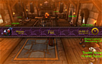
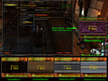

# AFK Fullscreen warning (WoW AddOn)

&nbsp; &nbsp; &nbsp; &nbsp;

## Description
This addon can warn you if you character is AFK.

  

* Fullscreen blinking orange like blizzards low health warning
* It can hide the UI on AFK
* The info panel displaying the time since AFK and something more
* The info panel look is changable (skin support)

## My other projects
* [On Curseforge](https://www.curseforge.com/members/hizuro_de/projects)
* [On Github](https://github.com/hizuro?tab=repositories)

## Disclaimer
> World of Warcraft© and Blizzard Entertainment© are all trademarks or registered trademarks of Blizzard Entertainment in the United States and/or other countries. These terms and all related materials, logos, and images are copyright © Blizzard Entertainment. The author of this addon is in no way associated with or endorsed by Blizzard Entertainment ©
